# RBS Test Exercise

## Структура файлов для простого приложения на Go

Для сборки проекта требуются следующие составляющие:  

- Исходный код на **Go**  

- **Dockerfile** для сборки image приложения, оптимизированный для экономии места на диске с помощью multi-stage build  

- Файл **docker-compose.yml** для запуска приложения  

- Директория **db/** с созданием таблицы по умолчанию и добавлением туда одной строки со значениями, если их ещё нет  

- Директория с конфигурационными файлами для веб-сервера **nginx**  

- Файл **.envrc**, который предварительно был свалидирован командой `direnv allow`, в нём хранятся переменные окружения для создания пользователя PostgreSQL `$PGUSER`, его пароль`$PG_PASSWORD`, прямого доступа к которому для безопасности нет в репозитории GitHub, а также название Базы Данных `$PG_NAME`  

- Скрипт **deploy.sh**, который запускает наше приложение с помощью **docker-compose.yml** файла  

P.S. Структура Базы Данных была продумана так, чтобы данные не сбрасывались при перезапуске контейнеров, директория с данными примонтирована к директории внутри контейнера, соответственно данные хранятся локально и при при новом развертывании приложения на этом же сервере данные не буду утеряны. В контейнере всё запускается не от пользователя root.

## Развёртывание приложения

Для запуска приложения на сервере достаточно запустить скрипт **deploy.sh** командой `bash deploy.sh`, либо `./deploy.sh`  

## Проверка работоспособности приложения

1. Проверяем в CLI с помощью утилиты `curl`

Ключ `-i` используем, чтобы увидеть подробный вывод со статусом и типом данных, которые пришли в ответ на запрос  

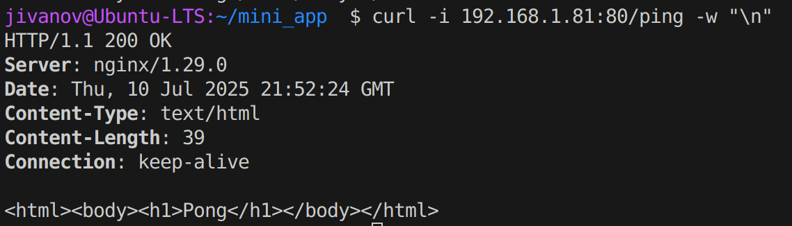  
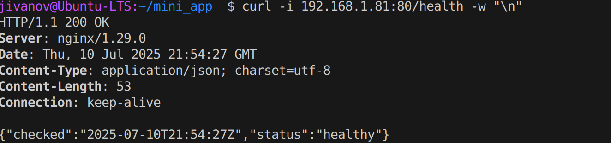  
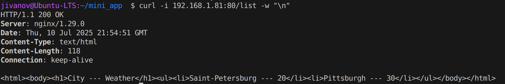

2. Проверяем в браузере - вводим http://ip-сервера/роутинг  

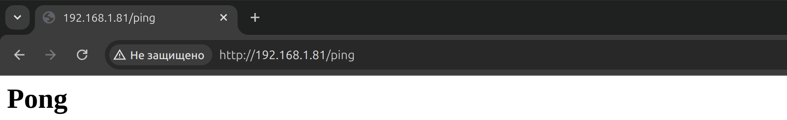
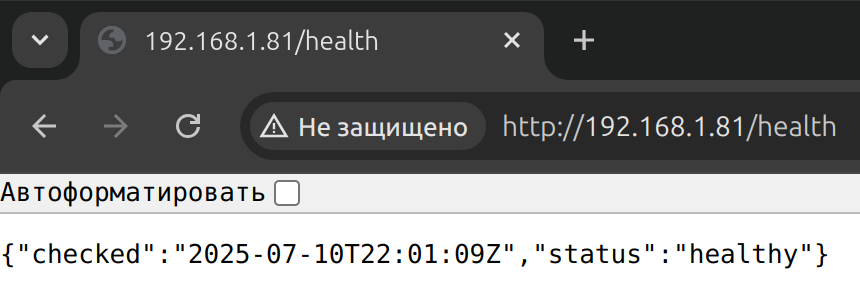
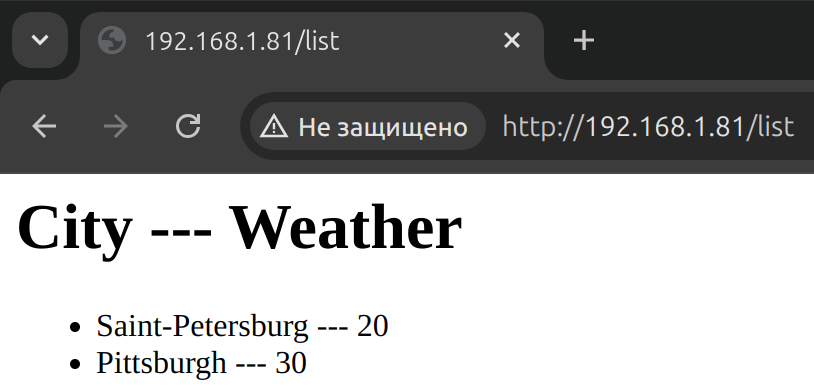  

3. Для проверки подключения Базы Данных к приложению нужно подключиться к ней прямо в контейнер

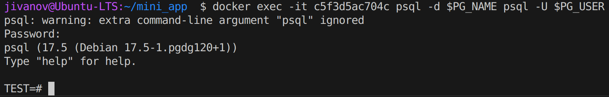

Также можно ввести команду `SELECT * FROM pg_stat_activity;` для просмотра активных и прошедших соединений  

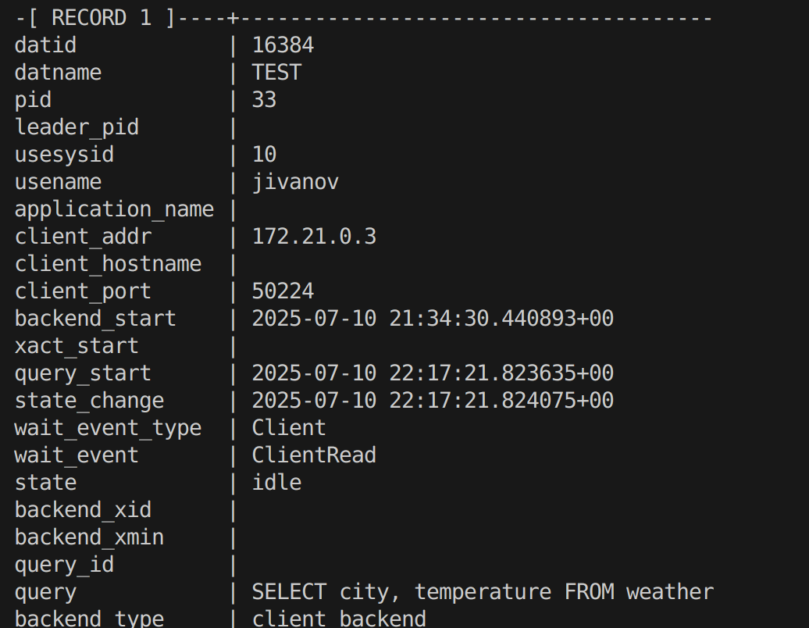

## Настройка автоматического развёртывания приложения на сервере с помощью github workflows в github actions

Для того, чтобы приложение автоматически развёртывалось был использован сервер с белым IP-адресом    

Для начала в секретах были прописаны переменные окружения для дальнейшего использования в yaml файле, для БД Postgres - `$PGUSER`, `$PG_USER`, `$PG_PASSWORD`, для подключения к серверу с помощью пары SSH-ключей - `$SSH_HOST`, `$SSH_PORT`, `$SSH_PRIVATE_KEY`, `$SSH_USER`  
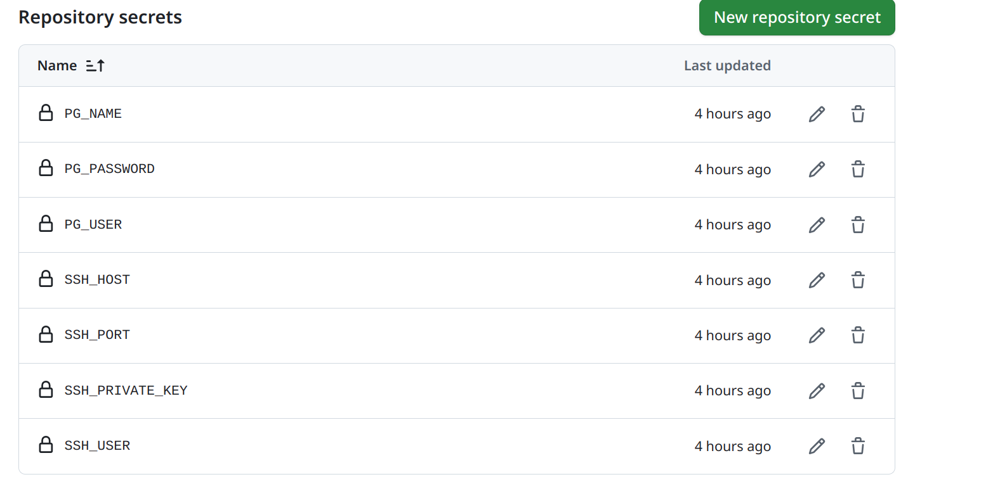

Далее был написан yaml-файл для автоматического деплоя приложения на сервере, после коммита и пуша видим workflow run
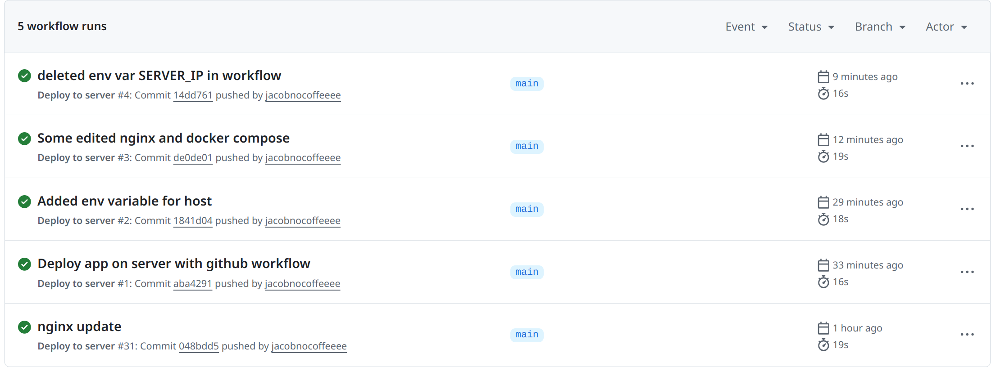  

Проверим, что приложение и правда работает, обратившись к нему прямо из браузера  

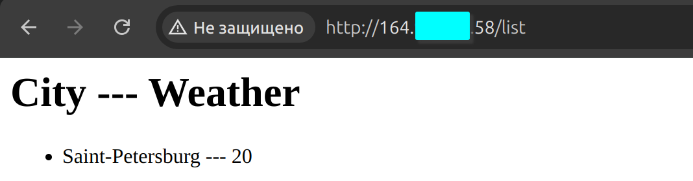
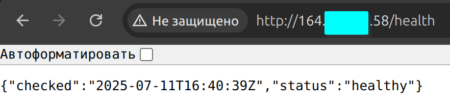

## Тест роутинга /add в приложении 
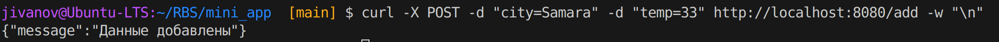
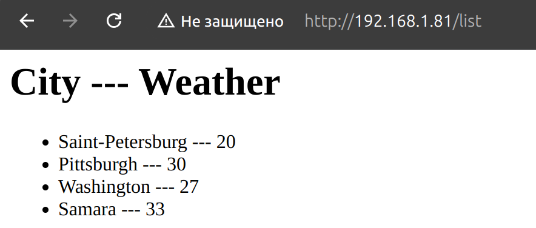  